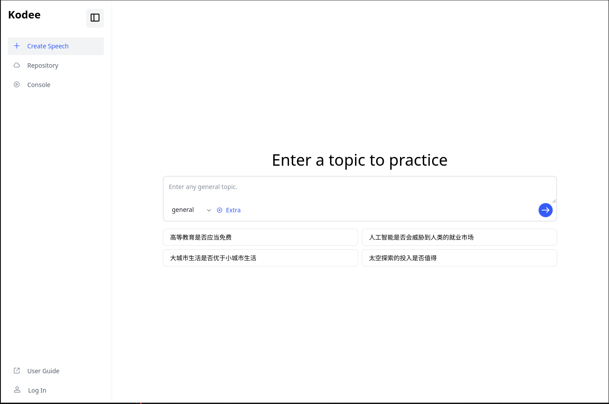
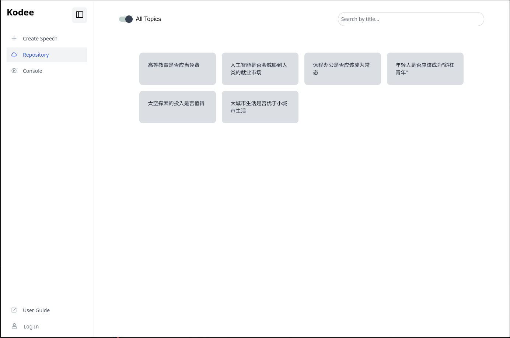
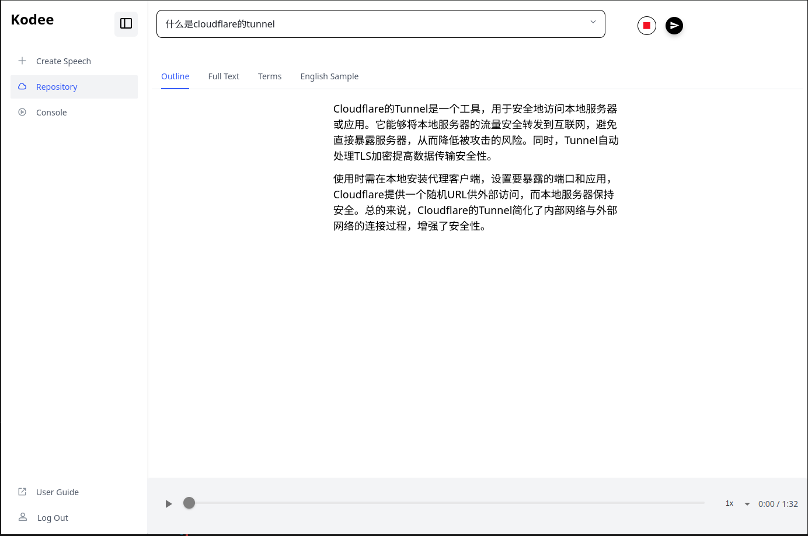
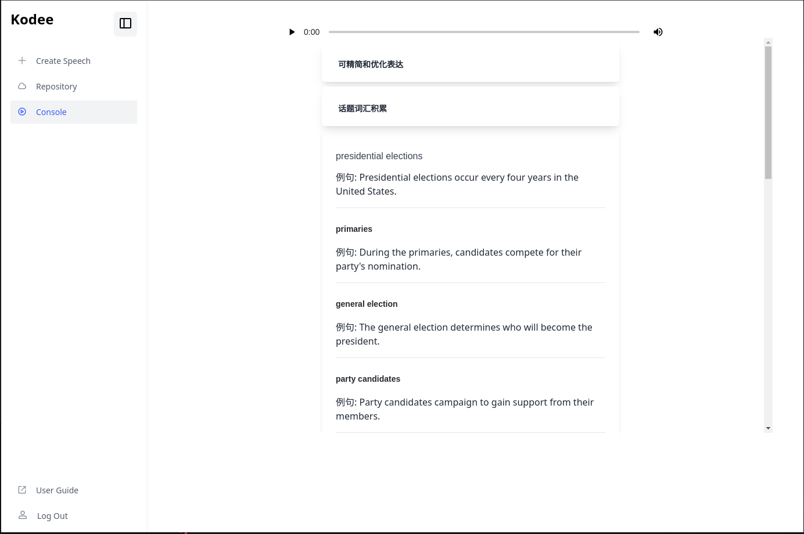

# Kodee 话题口语学习的最佳工具：

[Kodee](https://kodee.io)是我用业余时间自己做的一个产品，结合了学习笔记和口语练习两个需求。因为时间，资源和能力方面的限制，kodee满足的是一类垂直的需求.

## 用户画像：
- 最最最符合我设计产品初衷的三类用户：
- （1）小a，大学学生，学习计算机/金融/法律/工科等，希望能够用英语讲专业知识讲得清除，明白，因为希望出国读书/作英语学术汇报/单纯提高能力等。
- （2）小b, 准备雅思托福口语，但是又不希望准备过程过于应试，想同时真正提高自己的口语水平。

- 因此可以看出，使用还是有一定门槛的，需要有一定英语基础，比如四六级，或者雅思6+水平。
- 另外，需要认同kodee的设计理念：学英语在于高效表达，而不是词汇背诵，和词藻堆砌。
- 对于还在起步阶段的朋友，可以找些优秀的资源，先解决下发音，基本词汇和语法的问题。

## 使用说明：
- kodee只供个人使用，严禁商用。

## 使用流程（待更新）：
- 进入kodee之后就会看到以下界面，新用户首先需要注册登陆，基本上所有的功能都需要注册状态才能使用。
- 注册后可以在输入输入想要练习的话题，再点击右边类似播放键的按钮开始生成文字部分。
- 比如说我生成一篇关于elasticsearch的文章
- 输入栏下面的话题点击可以直接进入对应演讲的练习界面，但是注意这些内容只有中文语音。
  

- 文章生成完成后，就会进入repository页面，下拉或者搜索找到刚刚生成的演讲，如下图所示。
- 左上角如果显示private,表示只显示自己生成的文章，点击之后会显示all topics，表示显示自己生成的文章+预设的文章。
- 对于一篇新生成的内容，如下图所示，可以选择英语和中文，然后点击右边的按钮生成对应的语音，生成中会显示"speech is being created"。

- 短的内容差不多40秒左右能生成完成，需要刷新可以看到，如下图所示。
- 这个时候点击标题，就可以进入这篇内容的练习界面。
  

- 如下图所示，在每个话题的练习界面，可以选择听中文/英文语音，看terms的中英文对照，文章的提纲，全文，以及对应的简洁高效英文版本。
- 如上所述，基于自己的练习目的，在复述前，可以选择看不同的东西。
- 在当前版本下，每个话题内容生成语音，只能在中文和英文中二选一，无法同时生成。
  

- 在开始复述的时候，可以点击下图所示start按键，开始转录。
- 转录结束点击箭头，切换到转录内容，点击右下角按键，稍等片刻，获得反馈。
- 这里有一个小bug,转录出来的内容是不可编辑的，但是这也不会影响获取反馈的质量
  

- 反馈准备好后，会进入如下图所示反馈界面
- 这里可以看到原文，示范，信息缺失分析，精简优化表达，话题词汇，以及后续问题
- 一般口语提高需求可以忽略信息缺失分析部分
- 后续问题可以拿来生成新的文章，来加深对这一话题的了解
  

  
## FAQ
- ...
- ...

## 后续更新：

- ...
- ...
- ...
