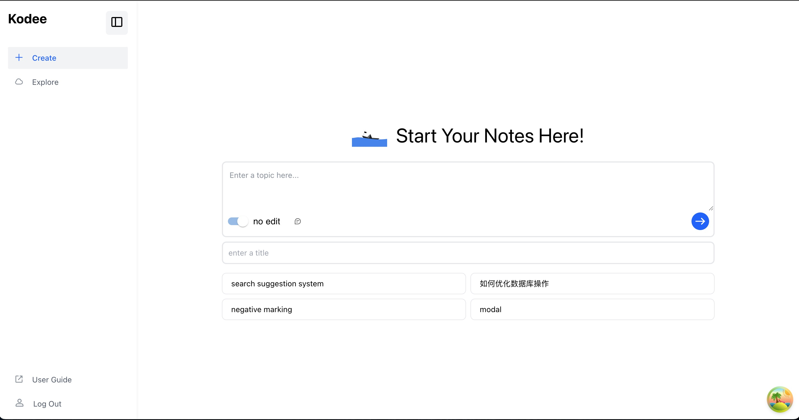
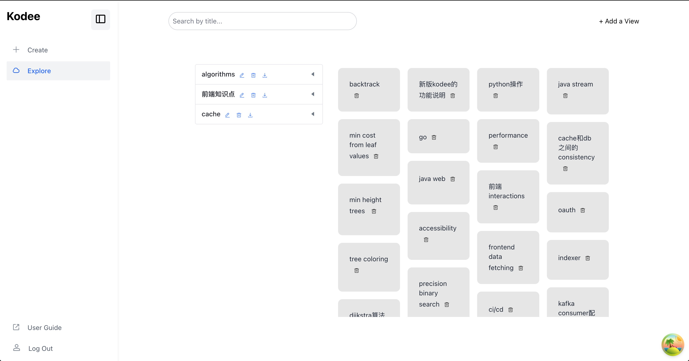
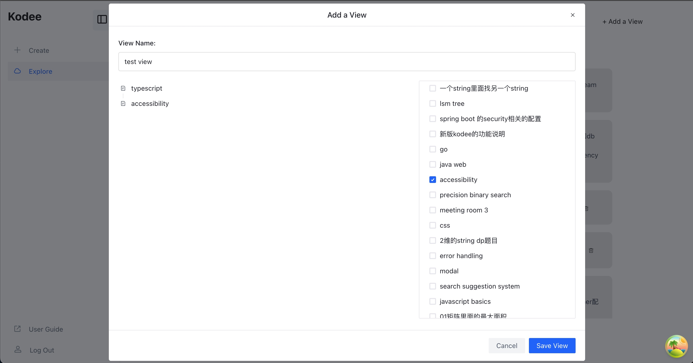

# [kodee.io](https://kodee.io)

## 设计理念：A copy of your brain

市面上已经有很多笔记软件了，我为什么还自己搞了一个呢？一方面是想练练手，有一个 side project 可以不断完善，变好，另一方面是我觉得我在记笔记上面确实有一些独特的需求，是市面上的软件没有能够满足的。

我希望能够满足的一个需求是记下来的东西是自己消化过的，梳理好的，而不是说问了 chatgpt，自己复制粘贴一下，格式搞得很漂亮，但可能过几天就忘了。

所以这里的标题写的是 a copy of your brain, 意思就是里面记的东西，都是别人问你，无论过了多久，都是能讲出来的。

之所以如此强调自己梳理和思考的过程，是因为现在有 ai 在，很容易就可以搞出一份看起来面面俱到的书面报告，但是能对某个领域的内容有自己的思考和见解，并且能够很清晰的讲出来，还是一个比较稀缺，也比较难培养的能力的。

我觉得学习应该是一个终身保持的习惯，而不是说为了某个考试，然后考完就忘了，如果是后者的话，学的过程会很痛苦，并且长期来看收益也不大。

那目标明确了，实现方法是什么呢？kodee 这个 app 实现了两个功能。

第一个就是以 topic 为单位，先从细碎的小知识点出发，然后再自己梳理逻辑，建立联系。大家应该都有过从零开始学习一个新的领域的经历，这种情况下，可能很多人会找一个该领域权威的书/笔记，然后用这个学习材料提供框架来学习这个新的领域。

但我觉得更有效，或者说个人更喜欢的方式是先从某些自己感兴趣的小 topic/知识点开始，先把这些知识点搞透了，然后再重复这个过程，当了解的足够多了再自己建立联系，梳理框架。我觉得这样一个完全反过来的逻辑是更符合学习的规律的，更容易做到吸收，内化，能解释给别人听。

所以 kodee 能够支持快速创建小 topic, 然后用户可以在里面梳理对于这个 topic 的理解，再用创建好的 topics 来创建 view, 也就是建立联系。

第二个功能就是如何保证单个 topic 是理解透彻的了。首先一个偏理论的点就是如果某个 topic 先要理解，是需要理解它的更高一层的概念的话，需要先把那个搞清楚，然后就是多问一些问题，比如说为什么会出现 xxx 技术栈，是为了解决什么问题，解决的思路是什么，有什么 trade-offs 等等。

另外就是 kodee 能够提供的实操层面的功能了。这里的理论基础是判断学会一个东西的标准，是能够用简洁，精准的语言来给领域外的人解释清楚。所以在 topic 的编辑页面，可以对着 kodee 解释，然后会有实时的语音转录，解释完了，就可以通过 ai 和设置 prompt 来获得对应的反馈。

这里保留了原先的“英语学习”功能，就是可以用中文去记笔记，英文来解释，反馈来获得英文表达相关的，就能够在掌握知识点的同时，提高实用英语。

这里想多讲一句“英语学习的理解”，我觉得对于英语水平的评判是能够用英语表达多少实际信息出来，以及表达时候简洁，准确，易懂。所以从这个角度来看，词汇积累，语言语调都没有那么的重要。

## 使用说明

创建账号，登陆之后会看到两个页面，一个是 create, 这个就是类似于现在 ai app 的对话框界面，可以在这里创建新的 topic。

这里可以在 no edit 和 optimised with ai 之间进行切换。no edit 就是写什么就保存什么，optimised with ai 就会根据默认 prompt 或者自己提供的 prompt 来让 ai 进行编辑和优化，我自己用下来是不太喜欢让 ai 来改的。

创建完 topics 就可以来到 explore 界面，这个页面的右边就是自己创建的所有的 topics,左边就是创建的所有 view。

我们先看点进 topic 之后的编辑页面。这里就是 topic 编辑和练习的主要页面，三个主要板块之间的大小是可以调整的，左边最大的板块就是 topic 的编辑板块，这里是用了类似于 notion 的 block-styled 编辑模式，每一个笔记可以在下面的菜单键选择导出成.md 的格式，然后下面的麦克风点击就可以开始练习解释，右下角的板块就会出现实时转录。右上角的 tabs 第一个是包含当前 topic 的 view，然后是所有练习反馈和练习转录内容（转录只支持英文）。

然后就是回到 explore 页面，能够通过右上角的加号来创建 view，在这个弹窗可以搜索到需要添加的 topics, 然后在左侧通过拖拽的方式来调整层级结构。另外，在 explore 页面每一个 view 的操作栏中也有导出的功能，能够把这个 view 里面的所有的 topics，按照自定义的层级来导出一个完整的.md 文件。

## kodee 是怎么变成今天这个版本的

kodee 这个项目也算是经历了两次 pivot。会有这两次变化，一方面是自己水平的提高，感觉能够做更复杂的东西了。另外一方面是因为作为一个 side project, 还是希望能够是自己能用上的 app, 这样才会一直用动力去完善。

kodee 一开始的定位是专门给口译员使用的辅助 app, 但是因为我自己已经不在这个行业了，对于口译员的需求已经不太清楚了，所以转型到了一个学术型口语的提高软件。

但是在使用第二个版本的 kodee 的时候，我发现 ai 生成的内容质量实在是有点差，内容很泛，自己都不会有想练习的动力。勉强去学里面的内容和表达，学不到知识，也练不出简洁有力的表达。

所以我就想让用户自己来提供练习的内容，所以就顺理成章的有了一个笔记功能，以及加入我上面阐述的自己摸索出来的学习规律，再加上第二个版本里面的口语练习功能，就是现在最新版本的 kodee 了。

我自己是已经用 kodee 在学习我现在接触到的所有内容了，我自己在使用中遇到的问题，有时间的时候会再改，我也会在这个 readme 里面记录我现在在修的 bugs 和写的 features。

## react 开发 tutorials

kodee 主要还是个前端项目，后端很简单。现在 AI 辅助， vibe coding 可以做的很好了，也让更多人能够自己开发些小的 web app。但是我觉得自己还是需要懂基础的 react 的概念和框架的，不然的话纯 vibe coding 只能做些简单的 app, 以及一旦出现 bugs 就会束手无策。

我自己的前端开发也是从零开始学的，有一些小心得，所以我接下来可能会以 kodee 的代码作为样本，出些 react 教程，从 high-level 来讲一讲一个前端的 react app 里面都需要有什么，这样不是很有 cs 基础的小伙伴，在 vibe coding 的时候能够更得心应手一些。

## 待开发 features

- bug fix
- password reset