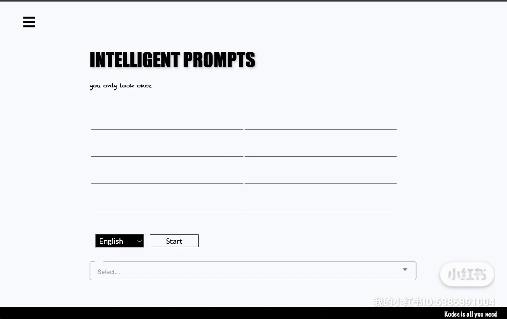

# Kodee, a language service provider

[Kodee](https://kodeeinc.com) is an independent open-source project that aims to be the best AI-powered language assistant for conference interpreters and more.

Core functions for now are as follows:
- real-time transcription
- terminology prompt
- glossary management
- community

To know more about me, please visit [my personal page](https://liu6-66.github.io/personal_page/)

## Usage

[Kodee](https://kodeeinc.com) is deployed at aws EC2 and accessible at https://kodeeinc.com. It is best viewed on a Mac Laptop because its UI is tailored for the Mac system(To be updated). Watch this [demo](https://drive.google.com/file/d/1xWksOjN058cjTUgIwNw4-Ot2cYEClY_9/view?usp=drive_link) for a how-to demonstration.

Alternatively, you can run this Spring Boot backend locally by running the CaiAppApplication file to for the endpoints to become available. Please remember to provide your own credentials for connecting to a Postgres database.

```java
spring.datasource.url=jdbc:postgresql://     
spring.datasource.username =
spring.datasource.password = 
```

And install the following dependency

```bash


```


## Demo


- the terminology prompt page from Kodee.
- please watch the [demo](https://drive.google.com/file/d/1xWksOjN058cjTUgIwNw4-Ot2cYEClY_9/view?usp=drive_link) for a how-to demonstration.
  for more instructions or give it a try at [link](https://kodeeinc.com). 

## Roadmap

- enhance the real-time transcription module
- ...
- ...
- ...
